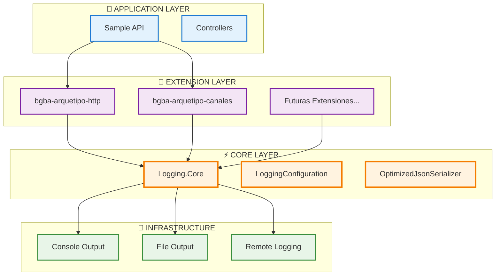
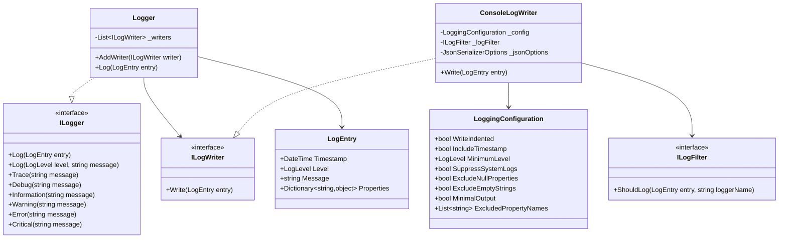
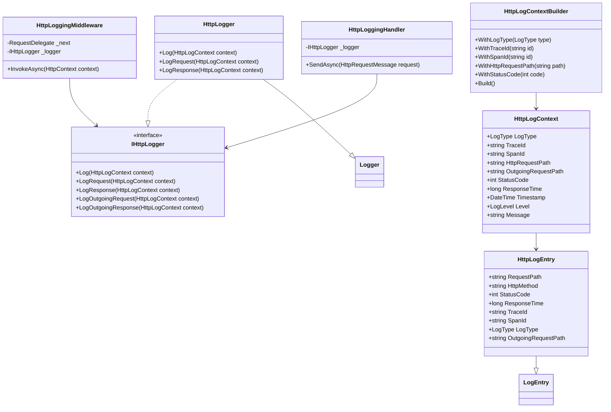
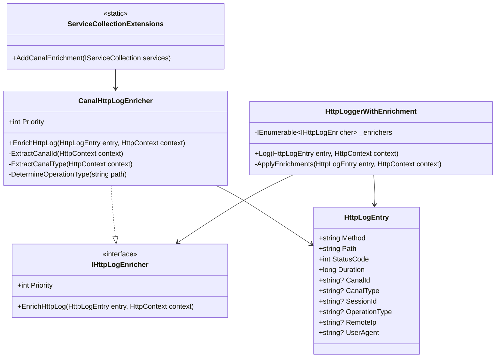
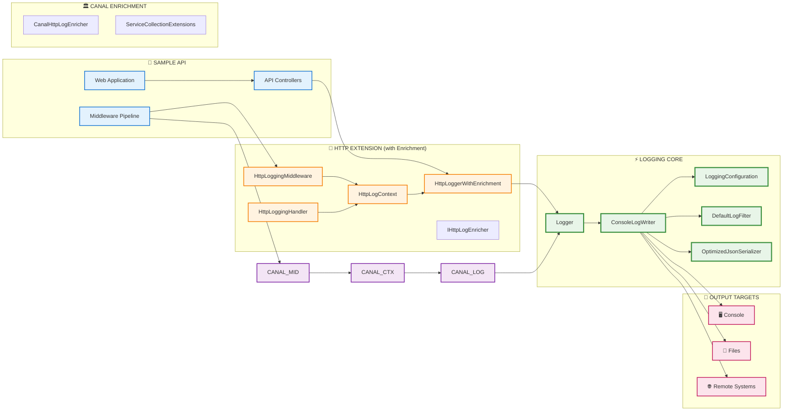
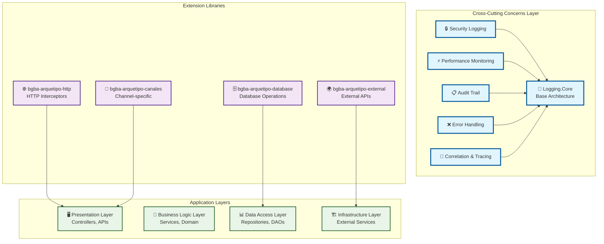
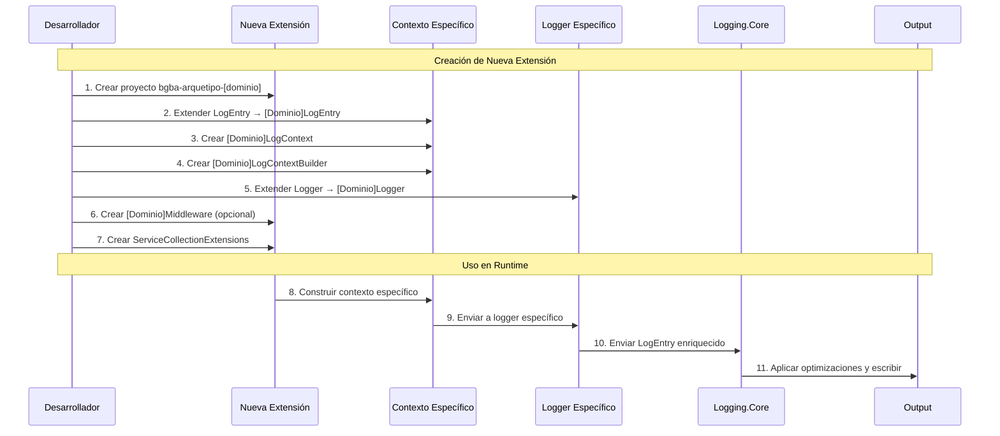
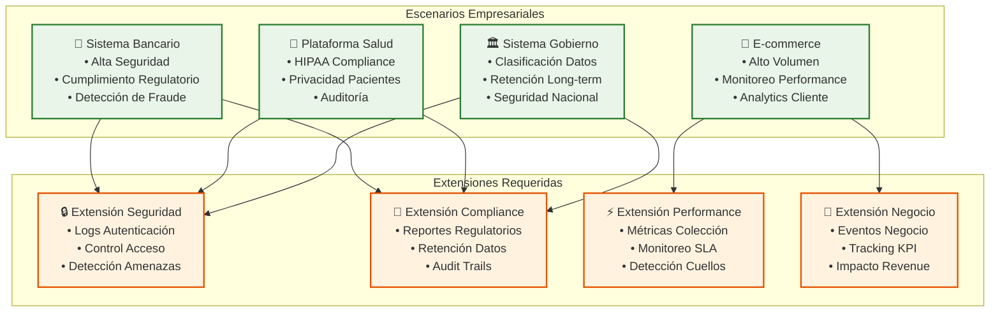
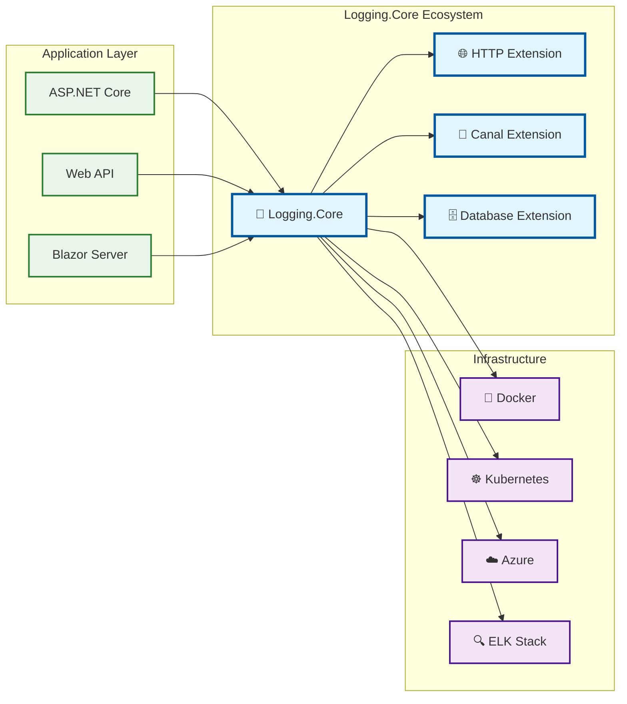

# 🏗️ Arquitectura del Sistema - POC Arquetipo Logging

## 📋 Índice
1. [Vista General](#-vista-general)
2. [Diagrama de Clases](#-diagrama-de-clases)
3. [Diagrama de Componentes](#-diagrama-de-componentes)
4. [Flujo de Extensión](#-flujo-de-extensión)
5. [Restricciones y Límites](#-restricciones-y-límites)
6. [Guía de Extensión](#-guía-de-extensión)

## 🔍 Vista General

### Arquitectura en Capas


## 🎨 Diagrama de Clases

### Core Components


### HTTP Extension


### Canal Enrichment Pattern


## 🧩 Diagrama de Componentes



## 🏗️ Cross-Cutting Concerns

### **Capas Transversales**


## 🔄 Flujo de Extensión

### Patrón de Extensión para Nuevos Dominios


## 🔧 Funcionalidades de Control

### **Sistema de Filtros Avanzado**
```csharp
var loggingConfig = new LoggingConfiguration
{
    WriteIndented = true,
    SuppressSystemLogs = true,              // Suprimir logs de Microsoft/System
    OnlyArquetipoLogs = false,              // Si es true, SOLO muestra logs del arquetipo
    ArquetipoPrefix = "Bgba",               // Prefijo que identifica componentes del arquetipo
    ExcludedLoggerPrefixes = new List<string>
    {
        "Microsoft",                        // Excluir Microsoft.*
        "System",                          // Excluir System.*
        "Microsoft.Extensions",            // Excluir Microsoft.Extensions.*
        "Microsoft.AspNetCore",           // Excluir Microsoft.AspNetCore.*
        "Microsoft.EntityFrameworkCore",  // Excluir EF Core logs
        "Microsoft.Hosting"               // Excluir hosting logs
    }
};
```

### **Detección Automática del Logger Name**
Cada log incluye automáticamente el nombre de la clase que lo generó:

```json
{
  "logType": "REQUEST",
  "traceId": "abc-123",
  "spanId": "def-456", 
  "httpRequestPath": "/api/users",
  "loggerName": "UserController",          // ← Nombre de la clase detectado automáticamente
  "timestamp": "2025-08-28T15:30:00.000Z",
  "level": "Information",
  "message": "Processing user request"
}
```

### **Configuraciones por Ambiente**
```csharp
// Producción (Máximo control)
var prodConfig = new LoggingConfiguration
{
    WriteIndented = false,
    SuppressSystemLogs = true,
    OnlyArquetipoLogs = true,             // SOLO arquetipo
    ArquetipoPrefix = "Bgba",
    MinimumLevel = LogLevel.Information
};

// Desarrollo (Debugging habilitado)  
var devConfig = new LoggingConfiguration
{
    WriteIndented = true,                 // JSON legible
    SuppressSystemLogs = true,            // Sin ruido del sistema
    OnlyArquetipoLogs = false,            // Incluir algunos logs útiles
    ArquetipoPrefix = "Bgba",
    MinimumLevel = LogLevel.Trace
};
```

## 📊 Casos de Uso Empresariales

### **Matriz de Implementación**


### **Stack Tecnológico Integrado**


### **Checklist de Implementación**
#### ✅ **Infraestructura Core** (Completado)
- [x] Arquitectura básica Logging.Core
- [x] Extensión HTTP con middleware
- [x] Patrones Context y Builder
- [x] Gestión de configuración
- [x] Framework de testing

#### 🔄 **Desarrollo Actual** (En Progreso)
- [x] HTTP interceptors mejorados
- [x] Optimización performance
- [x] Integración seguridad
- [x] Enriquecimiento contexto avanzado

#### 📋 **Extensiones Planificadas**
- [ ] Extensión logging database
- [ ] Extensión message queue
- [ ] Logging operaciones cache
- [ ] Extensiones específicas por canal
- [ ] Logging APIs externas

## 🎯 Restricciones Arquitectónicas

### 🚫 **LO QUE NO SE PUEDE HACER**

#### **1. Violaciones de Arquitectura**
```csharp
// ❌ PROHIBIDO: Extensión accediendo directamente a Core internals
public class BadExtension 
{
    public void BadMethod() 
    {
        // No acceder directamente a ConsoleLogWriter
        var writer = new ConsoleLogWriter(); // ❌ PROHIBIDO
        
        // No modificar LoggingConfiguration desde extensión
        config.InternalMethod(); // ❌ PROHIBIDO
    }
}
```

#### **2. Dependencias Circulares**
```csharp
// ❌ PROHIBIDO: Logging.Core NO puede depender de extensiones
namespace Logging.Core 
{
    public class Logger 
    {
        // ❌ No referenciar bgba-arquetipo-http
        private HttpLogger _httpLogger; // ❌ PROHIBIDO
    }
}
```

#### **3. Modificación de Clases Core**
```csharp
// ❌ PROHIBIDO: Modificar LogEntry directamente
public class LogEntry 
{
    // ❌ No agregar propiedades específicas de dominio aquí
    public string HttpMethod { get; set; } // ❌ PROHIBIDO
    public string CanalId { get; set; } // ❌ PROHIBIDO
}
```

### ✅ **LO QUE SÍ SE PUEDE HACER**

#### **1. Extensión Correcta**
```csharp
// ✅ CORRECTO: Extensión por herencia
public class DatabaseLogEntry : LogEntry 
{
    public string ConnectionString { get; set; }
    public string Query { get; set; }
    public long ExecutionTime { get; set; }
}
```

#### **2. Dependency Injection Apropiada**
```csharp
// ✅ CORRECTO: Registrar en DI container
public static class ServiceCollectionExtensions 
{
    public static IServiceCollection AddDatabaseLogging(
        this IServiceCollection services, 
        LoggingConfiguration config) 
    {
        services.AddSingleton<IDatabaseLogger>(provider => 
        {
            var logger = new DatabaseLogger();
            logger.AddWriter(new ConsoleLogWriter(config.WriteIndented));
            return logger;
        });
        
        return services;
    }
}
```

### 🎯 **Límites Técnicos**

#### **1. Performance**
- **Máximo 10,000 logs/segundo** por instancia
- **Serialización JSON limitada a 1MB** per log entry
- **Buffer máximo de 100MB** en memoria

#### **2. Configuración**
- **Máximo 50 propiedades** en ExcludedPropertyNames
- **Máximo 10 LogWriters** por Logger instance
- **MinimumStringLength no puede exceder 1000** caracteres

#### **3. Extensión**
- **Máximo 5 niveles de herencia** desde LogEntry
- **Propiedades específicas limitadas a 20** por extensión
- **Nombre de dominio máximo 20 caracteres** (bgba-arquetipo-[max20chars])

## 🛠️ Guía de Extensión

### **Paso a Paso para Nueva Extensión**

#### **1. Setup del Proyecto**
```bash
# Crear nuevo proyecto
dotnet new classlib -n bgba-arquetipo-[dominio]
cd bgba-arquetipo-[dominio]

# Agregar referencia a Logging.Core
dotnet add reference ../Logging.Core/Logging.Core.csproj

# Agregar a solución
dotnet sln ../PoC-Arquetipo-Logging.sln add .
```

#### **2. Estructura Mínima Requerida**
```
bgba-arquetipo-[dominio]/
├── [Dominio]LogEntry.cs        # Extender LogEntry
├── [Dominio]LogContext.cs      # Contexto específico
├── [Dominio]LogContextBuilder.cs # Builder pattern
├── [Dominio]Logger.cs          # Logger específico
├── Extensions/
│   └── ServiceCollectionExtensions.cs # DI setup
└── Middleware/ (opcional)
    └── [Dominio]LoggingMiddleware.cs
```

#### **3. Template de Implementación**
```csharp
// [Dominio]LogEntry.cs
public class [Dominio]LogEntry : LogEntry 
{
    public string [Propiedad1] { get; set; }
    public string [Propiedad2] { get; set; }
    // ... propiedades específicas del dominio
}

// [Dominio]Logger.cs
public class [Dominio]Logger : Logger 
{
    public void Log([Dominio]LogContext context) 
    {
        var entry = context.ToLogEntry();
        base.Log(entry);
    }
}
```

#### **4. Checklist de Validación**
- [ ] ✅ Extiende LogEntry (no modifica)
- [ ] ✅ Implementa Builder pattern
- [ ] ✅ Registra en DI correctamente  
- [ ] ✅ No depende de otras extensiones
- [ ] ✅ Documenta las nuevas propiedades
- [ ] ✅ Incluye tests unitarios
- [ ] ✅ Sigue naming convention bgba-arquetipo-[dominio]

---

## 📚 Referencias

- [Extension Patterns](extension-patterns.md)
- [Banking Optimizations](log-optimization-banking.md)
- [Configuration Guide](../README.md)

---

*📅 Última actualización: 29 de agosto de 2025*
*👨‍💻 Mantenido por: Equipo de Arquitectura*
