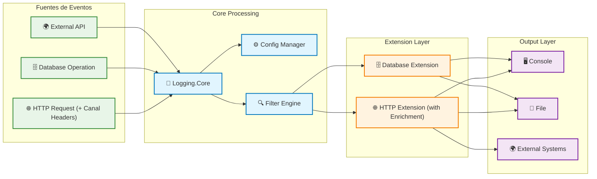

# 🔌 Guía de Extensión - POC Arquetipo Logging

## 🎯 Objetivo
Esta guía te enseña cómo crear nuevas extensiones del sistema de logging siguiendo los patrones establecidos y respetando las restricciones arquitectónicas.

## 📋 Prerequisitos
- .NET 8.0 SDK
- Conocimiento de C# y patrones de diseño
- Familiaridad con Dependency Injection
- Entendimiento de la [Arquitectura del Sistema](ARCHITECTURE.md)

## 🚀 Ejemplo Completo: Extensión para Database Logging

### **Paso 1: Crear el Proyecto**

```bash
# Navegar al directorio raíz
cd /ruta/al/proyecto/Poc-Arquetipo

# Crear nuevo proyecto de extensión
dotnet new classlib -n bgba-arquetipo-database
cd src/bgba-arquetipo-database

# Agregar referencia a Logging.Core
dotnet add reference ../Logging.Core/Logging.Core.csproj

# Agregar a la solución
cd ../..
dotnet sln add src/bgba-arquetipo-database/bgba-arquetipo-database.csproj
```

### **Paso 2: Definir el LogEntry Específico**

```csharp
// src/bgba-arquetipo-database/DatabaseLogEntry.cs
using Logging.Core;
using System.ComponentModel;

namespace BgbaArquetipoDatabase
{
    /// <summary>
    /// Log entry específico para operaciones de base de datos
    /// </summary>
    public class DatabaseLogEntry : LogEntry, ILoggerNameProvider
    {
        /// <summary>
        /// Cadena de conexión utilizada (sanitizada)
        /// </summary>
        public string? ConnectionString { get; set; }
        
        /// <summary>
        /// Query SQL ejecutado (puede ser sanitizado)
        /// </summary>
        public string? SqlQuery { get; set; }
        
        /// <summary>
        /// Tiempo de ejecución en millisegundos
        /// </summary>
        public long ExecutionTimeMs { get; set; }
        
        /// <summary>
        /// Número de filas afectadas
        /// </summary>
        public int RowsAffected { get; set; }
        
        /// <summary>
        /// Tipo de operación de database
        /// </summary>
        public DatabaseOperationType OperationType { get; set; }
        
        /// <summary>
        /// Nombre de la tabla principal involucrada
        /// </summary>
        public string? TableName { get; set; }
        
        /// <summary>
        /// Parámetros de la query (sanitizados)
        /// </summary>
        public Dictionary<string, object?> Parameters { get; set; } = new();
        
        /// <summary>
        /// Nombre del logger para identificación
        /// </summary>
        public string? LoggerName { get; set; }
    }
    
    /// <summary>
    /// Tipos de operaciones de base de datos
    /// </summary>
    public enum DatabaseOperationType
    {
        Select,
        Insert,
        Update,
        Delete,
        StoredProcedure,
        Transaction,
        Connection,
        Error
    }
}
```

### **Paso 3: Crear el Contexto**

```csharp
// src/bgba-arquetipo-database/DatabaseLogContext.cs
using Logging.Core;

namespace BgbaArquetipoDatabase
{
    /// <summary>
    /// Contexto para logging de operaciones de base de datos
    /// </summary>
    public class DatabaseLogContext
    {
        public DateTime Timestamp { get; set; } = DateTime.UtcNow;
        public LogLevel Level { get; set; } = LogLevel.Information;
        public string Message { get; set; } = string.Empty;
        public string? ConnectionString { get; set; }
        public string? SqlQuery { get; set; }
        public long ExecutionTimeMs { get; set; }
        public int RowsAffected { get; set; }
        public DatabaseOperationType OperationType { get; set; }
        public string? TableName { get; set; }
        public Dictionary<string, object?> Parameters { get; set; } = new();
        public string? LoggerName { get; set; }
        
        /// <summary>
        /// Convierte el contexto a una entrada de log
        /// </summary>
        public DatabaseLogEntry ToLogEntry()
        {
            return new DatabaseLogEntry
            {
                Timestamp = Timestamp,
                Level = Level,
                Message = Message,
                ConnectionString = SanitizeConnectionString(ConnectionString),
                SqlQuery = SqlQuery,
                ExecutionTimeMs = ExecutionTimeMs,
                RowsAffected = RowsAffected,
                OperationType = OperationType,
                TableName = TableName,
                Parameters = SanitizeParameters(Parameters),
                LoggerName = LoggerName
            };
        }
        
        /// <summary>
        /// Sanitiza la cadena de conexión removiendo información sensible
        /// </summary>
        private string? SanitizeConnectionString(string? connectionString)
        {
            if (string.IsNullOrEmpty(connectionString))
                return connectionString;
                
            // Remover password, user id, etc.
            return System.Text.RegularExpressions.Regex.Replace(
                connectionString, 
                @"(password|pwd|user id|uid)=[^;]*;?", 
                "$1=***;", 
                System.Text.RegularExpressions.RegexOptions.IgnoreCase);
        }
        
        /// <summary>
        /// Sanitiza parámetros removiendo valores sensibles
        /// </summary>
        private Dictionary<string, object?> SanitizeParameters(Dictionary<string, object?> parameters)
        {
            var sanitized = new Dictionary<string, object?>();
            var sensitiveKeys = new[] { "password", "pwd", "secret", "token", "key" };
            
            foreach (var param in parameters)
            {
                if (sensitiveKeys.Any(key => param.Key.ToLower().Contains(key)))
                {
                    sanitized[param.Key] = "***";
                }
                else
                {
                    sanitized[param.Key] = param.Value;
                }
            }
            
            return sanitized;
        }
    }
}
```

### **Paso 4: Implementar el Builder**

```csharp
// src/bgba-arquetipo-database/DatabaseLogContextBuilder.cs
using Logging.Core;
using System.Data.Common;
using System.Runtime.CompilerServices;

namespace BgbaArquetipoDatabase
{
    /// <summary>
    /// Builder para construir contextos de logging de base de datos
    /// </summary>
    public class DatabaseLogContextBuilder
    {
        private readonly DatabaseLogContext _context = new();
        
        /// <summary>
        /// Crea una nueva instancia del builder
        /// </summary>
        public static DatabaseLogContextBuilder Create() => new();
        
        /// <summary>
        /// Establece el timestamp
        /// </summary>
        public DatabaseLogContextBuilder WithTimestamp(DateTime timestamp)
        {
            _context.Timestamp = timestamp;
            return this;
        }
        
        /// <summary>
        /// Establece el nivel de log
        /// </summary>
        public DatabaseLogContextBuilder WithLevel(LogLevel level)
        {
            _context.Level = level;
            return this;
        }
        
        /// <summary>
        /// Establece el mensaje
        /// </summary>
        public DatabaseLogContextBuilder WithMessage(string message)
        {
            _context.Message = message;
            return this;
        }
        
        /// <summary>
        /// Establece la cadena de conexión
        /// </summary>
        public DatabaseLogContextBuilder WithConnectionString(string connectionString)
        {
            _context.ConnectionString = connectionString;
            return this;
        }
        
        /// <summary>
        /// Establece la query SQL
        /// </summary>
        public DatabaseLogContextBuilder WithSqlQuery(string sqlQuery)
        {
            _context.SqlQuery = sqlQuery;
            return this;
        }
        
        /// <summary>
        /// Establece el tiempo de ejecución
        /// </summary>
        public DatabaseLogContextBuilder WithExecutionTime(long executionTimeMs)
        {
            _context.ExecutionTimeMs = executionTimeMs;
            return this;
        }
        
        /// <summary>
        /// Establece las filas afectadas
        /// </summary>
        public DatabaseLogContextBuilder WithRowsAffected(int rowsAffected)
        {
            _context.RowsAffected = rowsAffected;
            return this;
        }
        
        /// <summary>
        /// Establece el tipo de operación
        /// </summary>
        public DatabaseLogContextBuilder WithOperationType(DatabaseOperationType operationType)
        {
            _context.OperationType = operationType;
            return this;
        }
        
        /// <summary>
        /// Establece el nombre de la tabla
        /// </summary>
        public DatabaseLogContextBuilder WithTableName(string tableName)
        {
            _context.TableName = tableName;
            return this;
        }
        
        /// <summary>
        /// Agrega un parámetro
        /// </summary>
        public DatabaseLogContextBuilder WithParameter(string name, object? value)
        {
            _context.Parameters[name] = value;
            return this;
        }
        
        /// <summary>
        /// Agrega múltiples parámetros
        /// </summary>
        public DatabaseLogContextBuilder WithParameters(Dictionary<string, object?> parameters)
        {
            foreach (var param in parameters)
            {
                _context.Parameters[param.Key] = param.Value;
            }
            return this;
        }
        
        /// <summary>
        /// Establece el nombre del logger automáticamente
        /// </summary>
        public DatabaseLogContextBuilder WithLoggerName([CallerMemberName] string callerMemberName = "")
        {
            _context.LoggerName = callerMemberName;
            return this;
        }
        
        /// <summary>
        /// Construye desde un DbCommand
        /// </summary>
        public DatabaseLogContextBuilder FromDbCommand(DbCommand command)
        {
            _context.SqlQuery = command.CommandText;
            _context.ConnectionString = command.Connection?.ConnectionString;
            
            // Extraer parámetros
            foreach (DbParameter param in command.Parameters)
            {
                _context.Parameters[param.ParameterName] = param.Value;
            }
            
            // Determinar tipo de operación
            var sql = command.CommandText?.Trim().ToUpper();
            _context.OperationType = sql switch
            {
                var s when s.StartsWith("SELECT") => DatabaseOperationType.Select,
                var s when s.StartsWith("INSERT") => DatabaseOperationType.Insert,
                var s when s.StartsWith("UPDATE") => DatabaseOperationType.Update,
                var s when s.StartsWith("DELETE") => DatabaseOperationType.Delete,
                var s when s.StartsWith("EXEC") || s.StartsWith("CALL") => DatabaseOperationType.StoredProcedure,
                _ => DatabaseOperationType.Select
            };
            
            return this;
        }
        
        /// <summary>
        /// Construye el contexto
        /// </summary>
        public DatabaseLogContext Build() => _context;
    }
}
```

### **Paso 5: Crear el Logger Específico**

```csharp
// src/bgba-arquetipo-database/DatabaseLogger.cs
using Logging.Core;

namespace BgbaArquetipoDatabase
{
    /// <summary>
    /// Logger específico para operaciones de base de datos
    /// </summary>
    public class DatabaseLogger : Logger
    {
        /// <summary>
        /// Log con contexto de base de datos
        /// </summary>
        public void Log(DatabaseLogContext context)
        {
            var entry = context.ToLogEntry();
            base.Log(entry);
        }
        
        /// <summary>
        /// Log de inicio de operación
        /// </summary>
        public void LogQueryStart(string query, DatabaseOperationType operationType, string? tableName = null)
        {
            var context = DatabaseLogContextBuilder.Create()
                .WithMessage($"Database operation started: {operationType}")
                .WithSqlQuery(query)
                .WithOperationType(operationType)
                .WithTableName(tableName)
                .WithLevel(LogLevel.Information)
                .WithLoggerName()
                .Build();
                
            Log(context);
        }
        
        /// <summary>
        /// Log de finalización exitosa
        /// </summary>
        public void LogQuerySuccess(string query, long executionTimeMs, int rowsAffected, DatabaseOperationType operationType)
        {
            var context = DatabaseLogContextBuilder.Create()
                .WithMessage($"Database operation completed successfully: {operationType}")
                .WithSqlQuery(query)
                .WithExecutionTime(executionTimeMs)
                .WithRowsAffected(rowsAffected)
                .WithOperationType(operationType)
                .WithLevel(LogLevel.Information)
                .WithLoggerName()
                .Build();
                
            Log(context);
        }
        
        /// <summary>
        /// Log de error en operación
        /// </summary>
        public void LogQueryError(string query, Exception exception, long executionTimeMs, DatabaseOperationType operationType)
        {
            var context = DatabaseLogContextBuilder.Create()
                .WithMessage($"Database operation failed: {exception.Message}")
                .WithSqlQuery(query)
                .WithExecutionTime(executionTimeMs)
                .WithOperationType(DatabaseOperationType.Error)
                .WithLevel(LogLevel.Error)
                .WithLoggerName()
                .Build();
                
            Log(context);
        }
    }
}
```

### **Paso 6: Configurar Dependency Injection**

```csharp
// src/bgba-arquetipo-database/Extensions/ServiceCollectionExtensions.cs
using Microsoft.Extensions.DependencyInjection;
using Logging.Core;

namespace BgbaArquetipoDatabase.Extensions
{
    /// <summary>
    /// Extension methods para configurar database logging
    /// </summary>
    public static class ServiceCollectionExtensions
    {
        /// <summary>
        /// Agrega database logging services al container de DI
        /// </summary>
        public static IServiceCollection AddDatabaseLogging(
            this IServiceCollection services, 
            LoggingConfiguration? config = null)
        {
            config ??= new LoggingConfiguration();
            
            // Crear filter basado en configuración
            var logFilter = new DefaultLogFilter(config);
            
            // Configurar DatabaseLogger
            var logger = new DatabaseLogger();
            logger.AddWriter(new ConsoleLogWriter(config.WriteIndented, logFilter, config));
            
            services.AddSingleton<DatabaseLogger>(logger);
            
            return services;
        }
        
        /// <summary>
        /// Agrega database logging con configuración personalizada
        /// </summary>
        public static IServiceCollection AddDatabaseLogging(
            this IServiceCollection services, 
            Action<DatabaseLogger> configure, 
            LoggingConfiguration? config = null)
        {
            config ??= new LoggingConfiguration();
            
            var logFilter = new DefaultLogFilter(config);
            var logger = new DatabaseLogger();
            logger.AddWriter(new ConsoleLogWriter(config.WriteIndented, logFilter, config));
            
            configure(logger);
            
            services.AddSingleton<DatabaseLogger>(logger);
            
            return services;
        }
    }
}
```

### **Paso 7: Uso en la Aplicación**

```csharp
// En Program.cs
using BgbaArquetipoDatabase.Extensions;

// Configurar database logging
builder.Services.AddDatabaseLogging(loggingConfig);

// En tu servicio o repositorio
public class UserRepository
{
    private readonly DatabaseLogger _logger;
    
    public UserRepository(DatabaseLogger logger)
    {
        _logger = logger;
    }
    
    public async Task<User> GetUserAsync(int userId)
    {
        var stopwatch = System.Diagnostics.Stopwatch.StartNew();
        var query = "SELECT * FROM Users WHERE Id = @userId";
        
        _logger.LogQueryStart(query, DatabaseOperationType.Select, "Users");
        
        try
        {
            // Ejecutar query...
            var result = await ExecuteQuery(query, userId);
            
            stopwatch.Stop();
            _logger.LogQuerySuccess(query, stopwatch.ElapsedMilliseconds, 1, DatabaseOperationType.Select);
            
            return result;
        }
        catch (Exception ex)
        {
            stopwatch.Stop();
            _logger.LogQueryError(query, ex, stopwatch.ElapsedMilliseconds, DatabaseOperationType.Select);
            throw;
        }
    }
}
```

## ✅ Checklist de Validación

Antes de considerar completa tu extensión, verifica:

### **📋 Estructura del Proyecto**
- [ ] ✅ Proyecto nombrado como `bgba-arquetipo-[dominio]`
- [ ] ✅ Referencia a `Logging.Core`
- [ ] ✅ Agregado a la solución principal
- [ ] ✅ Estructura de carpetas correcta

### **🏗️ Implementación**
- [ ] ✅ `[Dominio]LogEntry` extiende `LogEntry`
- [ ] ✅ Implementa `ILoggerNameProvider` si es necesario
- [ ] ✅ `[Dominio]LogContext` con método `ToLogEntry()`
- [ ] ✅ `[Dominio]LogContextBuilder` con patrón fluent
- [ ] ✅ `[Dominio]Logger` extiende `Logger`
- [ ] ✅ `ServiceCollectionExtensions` para DI

### **🔒 Seguridad**
- [ ] ✅ Sanitización de datos sensibles
- [ ] ✅ No exposición de credenciales
- [ ] ✅ Validación de inputs

### **📊 Performance**
- [ ] ✅ No bloquea el hilo principal
- [ ] ✅ Manejo eficiente de memoria
- [ ] ✅ Limites de tamaño respetados

### **🧪 Testing**
- [ ] ✅ Tests unitarios para LogEntry
- [ ] ✅ Tests para Builder
- [ ] ✅ Tests para Logger
- [ ] ✅ Tests de integración

### **📚 Documentación**
- [ ] ✅ XML documentation en clases públicas
- [ ] ✅ README específico del dominio
- [ ] ✅ Ejemplos de uso

## 🚫 Errores Comunes a Evitar

### **1. Violación de Dependency Direction**
```csharp
// ❌ INCORRECTO: Logging.Core no puede depender de extensiones
namespace Logging.Core
{
    public class Logger
    {
        private DatabaseLogger _dbLogger; // ❌ PROHIBIDO
    }
}
```

### **2. Modificación de Clases Core**
```csharp
// ❌ INCORRECTO: No modificar LogEntry base
public class LogEntry
{
    public string DatabaseQuery { get; set; } // ❌ PROHIBIDO
}
```

### **3. Acoplamiento entre Extensiones**
```csharp
// ❌ INCORRECTO: Una extensión no puede depender de otra
namespace BgbaArquetipoDatabase
{
    public class DatabaseLogger
    {
        private HttpLogger _httpLogger; // ❌ PROHIBIDO
    }
}
```

## 🏗️ Arquitectura de Extensiones

### **Patrón de Extensión Core**
```mermaid
classDiagram
    class LoggingCore {
        <<Core>>
        +ILogger logger
        +LoggingConfiguration config
        +ILogWriter[] writers
        +Log(LogEntry entry)
        +Configure(options)
    }

    class ILogContext {
        <<interface>>
        +DateTime Timestamp
        +LogLevel Level
        +string Message
        +string GetLogType()
        +Dictionary~string,object~ GetProperties()
    }

    class HttpLogContext {
        +LogType LogType
        +string TraceId
        +string SpanId
        +string HttpRequestPath
        +GetLogType() string
    }

    class DatabaseLogEntry {
        +string ConnectionString
        +string SqlCommand
        +TimeSpan ExecutionTime
        +int RecordsAffected
        +GetLoggerName() string
    }

    class CanalHttpLogEnricher {
        +int Priority
        +EnrichHttpLog(entry, context) void
    }

    LoggingCore ..> ILogContext : uses
    LoggingCore ..> DatabaseLogEntry : logs
    LoggingCore ..> CanalHttpLogEnricher : enriches HTTP
    
    classDef coreClass fill:#e1f5fe,stroke:#01579b,stroke-width:3px
    classDef interfaceClass fill:#fff3e0,stroke:#e65100,stroke-width:2px
    classDef extensionClass fill:#f3e5f5,stroke:#4a148c,stroke-width:2px
    classDef enrichmentClass fill:#e8f5e8,stroke:#2e7d32,stroke-width:2px
    
    class LoggingCore coreClass
    class ILogContext interfaceClass
    class HttpLogContext,DatabaseLogEntry extensionClass
    class CanalHttpLogEnricher enrichmentClass
```

### **Pipeline de Procesamiento**


### **Interfaces de Extensión**
```csharp
// Core extension interface
public interface ILoggingExtension
{
    string Name { get; }
    Version Version { get; }
    void Initialize(IServiceProvider services);
    bool CanHandle(LogEntry entry);
    Task ProcessAsync(LogEntry entry);
}

// Context factory pattern
public interface ILogContextFactory<T> where T : LogEntry
{
    T Create();
    T CreateFromHttpContext(HttpContext context);
    T CreateFromException(Exception exception);
}

// Configuration strategy
public class LoggingExtensionConfiguration
{
    public bool Enabled { get; set; }
    public LogLevel MinimumLevel { get; set; }
    public Dictionary<string, object> Properties { get; set; }
    public string[] OutputDestinations { get; set; }
}
```

## 🏆 Ejemplo Real: bgba-arquetipo-canales (Patrón de Enriquecimiento)

### **Casos de Uso Implementados**
La extensión de canales demuestra el **patrón de enriquecimiento** en acción:

- ✅ **Enriquecimiento HTTP**: Canal enriquece logs HTTP existentes (no logs separados)
- ✅ **Headers Automáticos**: Captura `X-Canal-Id`, `X-Canal-Type` desde headers
- ✅ **Campos Directos**: Propiedades tipadas en lugar de diccionarios
- ✅ **Un Solo Log**: HTTP + Canal = log unificado completo

### **Headers Capturados para Enriquecimiento**
| Header | Propiedad Enriquecida | Ejemplo |
|--------|----------------------|---------|
| `X-Canal-Id` | `canalId` | `mobile-app` |
| `X-Canal-Type` | `canalType` | `mobile` |
| `X-Session-Id` | `sessionId` | `sess_abc123` |

### **Output Real: HTTP Enriquecido con Canal**
```json
{
  "timestamp": "2025-08-28T10:30:00.000Z",
  "level": "Information", 
  "method": "POST",
  "path": "/api/authenticate",
  "statusCode": 200,
  "duration": 145,
  "requestSize": 234,
  "responseSize": 89,
  "canalId": "mobile-app",
  "canalType": "mobile", 
  "sessionId": "sess_abc123",
  "operationType": "Authentication",
  "remoteIp": "192.168.1.100",
  "userAgent": "MyBankApp/1.2.0"
}
```

**📌 Diferencia Clave:**
- **Antes**: 2 logs separados (HTTP + Canal)
- **Ahora**: 1 log HTTP enriquecido con información de canal

### **Uso en Controladores (Sin Cambios)**
```csharp
[ApiController]
public class CanalController : ControllerBase
{
    // No necesita CanalLogger - el enriquecimiento es automático
    
    [HttpGet("authenticate")]
    public IActionResult Authenticate()
    {
        // El middleware HTTP + enriquecedor de canal 
        // automáticamente genera el log completo
        return Ok();
    }
}
```

**📌 Beneficios del Patrón:**
- **Menos código**: Los controladores no necesitan logging manual
- **Un solo log**: Toda la información en un lugar
- **Automatización**: Enriquecimiento transparente sin intervención

## 📈 Próximos Pasos

1. **Implementar tu extensión** siguiendo este ejemplo
2. **Crear tests unitarios** comprehensivos
3. **Documentar casos de uso** específicos
4. **Optimizar performance** según tus necesidades
5. **Integrar con CI/CD** pipeline

## 🔗 Referencias

- [Arquitectura del Sistema](ARCHITECTURE.md)
- [Optimizaciones Bancarias](log-optimization-banking.md)
- [Patrones de Extensión](extension-patterns.md)

---

*📅 Última actualización: 29 de agosto de 2025*
*🔄 Revisión: v1.0*
