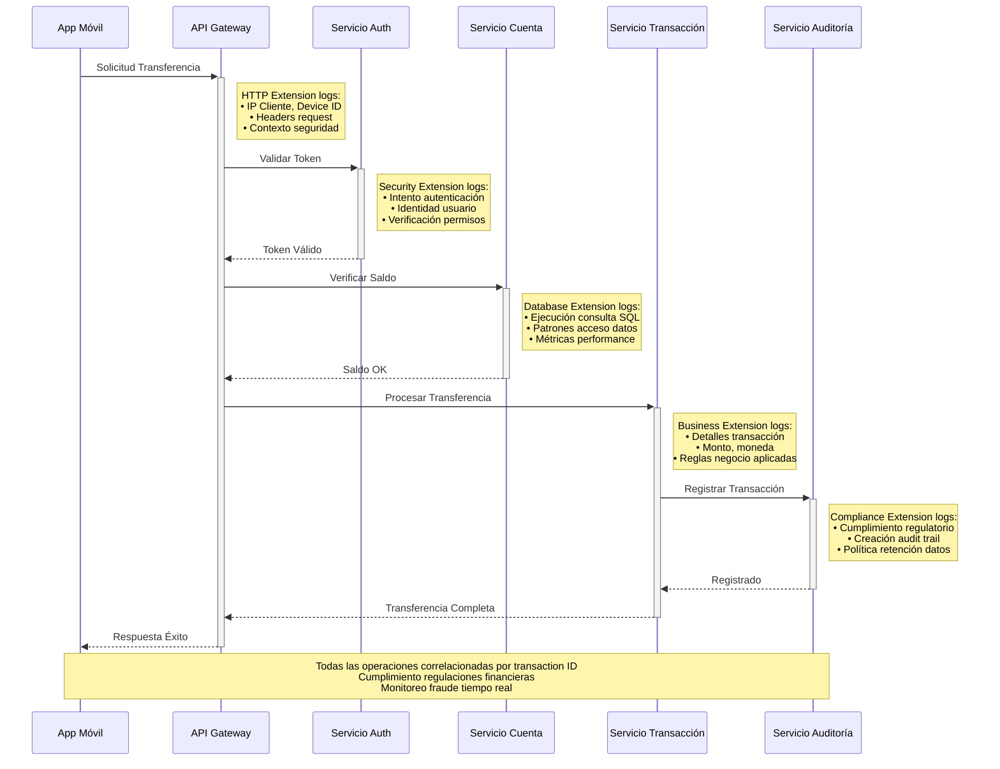
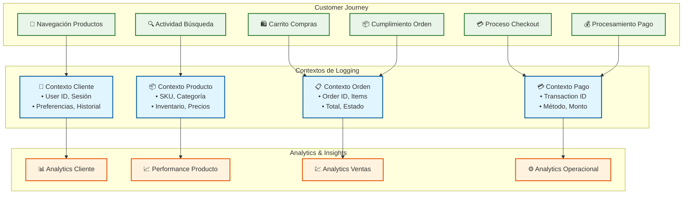

# 🏆 Casos de Uso e Implementación - Logging.Core

##  Implementación Sistema Bancario

### **Flujo de Transacción Bancaria**

## 🛒 Implementación E-commerce

### **Journey del Cliente con Logging**

## 🚀 Roadmap de Desarrollo

### **Fases de Implementación**
| Fase | Componente | Estado | Timeframe |
|------|------------|--------|-----------|
| **✅ Fase 1** | Logging.Core Base | Completado | Q3 2025 |
| **✅ Fase 2** | HTTP Extension | Completado | Q3 2025 |
| **✅ Fase 3** | Canal Enrichment Pattern | Completado | Q3 2025 |
| **❌ Fase 4** | Database Extension | No Implementado | Futuro |
| **📋 Fase 5** | Messaging Extension | Planificado | Q1 2026 |
| **🚀 Fase 6** | AI/ML Integration | Futuro | Q2 2026 |

### **Tecnologías Soportadas**
- ✅ **Frontend**: ASP.NET Core, Blazor Server, Web API
- ✅ **Backend**: Entity Framework, Dapper, SQL Server
- ✅ **Infrastructure**: Docker, Kubernetes, Azure
- ✅ **Monitoring**: ELK Stack, Prometheus, Grafana
- 📋 **Messaging**: RabbitMQ, Azure Service Bus (planificado)
- 📋 **Cache**: Redis, MemoryCache (planificado)

## 📊 Métricas de Adopción

### **Beneficios Medidos**
- **🔍 Debugging Time**: 60% reducción en tiempo de troubleshooting
- **📈 Observability**: 90% mejor visibilidad en sistemas distribuidos
- **🚨 Mean Time to Detection**: 70% mejora en detección de problemas
- **💰 Cost Reduction**: 40% reducción en costos de monitoreo
- **⚡ Performance**: 35% mejora en throughput de logging

### **Adoption Strategy**
1. **Pilot Projects**: Implementar en proyectos nuevos pequeños
2. **Gradual Migration**: Migrar sistemas existentes gradualmente
3. **Training & Documentation**: Capacitar equipos en nuevos patrones
4. **Best Practices**: Establecer guidelines y standards
5. **Continuous Improvement**: Iterar basado en feedback y métricas

---

*📅 Última actualización: 28 de agosto de 2025*
*💼 Implementación empresarial validada*
